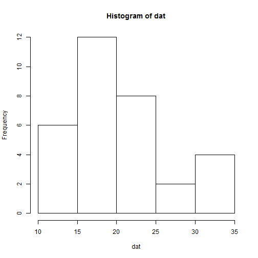

## Outline

1. What is Dynamic Histogram Plotter
2. How to use DHP
3. Example Run

--- .class #id 

## What is Dynamic Histogram Plotter

Dynamic Histogram Plotter is a basic web app built using ShinyApps in R. By default it loads the mtcars dataset from R; however, you can upload your own data and it will dynamically figure out the variable to plot from the headers of the dataset. On the server side, the program determines the variable names of the dataset and calculates the bins for the histogram.

--- .class #id 

## How to use DHP

1. Upload data, otherwise use default data (mtcars)
2. Select the variable that you want to plot

# Limitations:
1. Initially, it will have no data, so cannot plot anything until mtcars is uploaded.
2. If your data is not numeric, it will cause problems.

--- .class #id 

## Example Run

The following is a sample run of the app:


```r
#slidifyUI(
  data(mtcars)
  dat <- mtcars
  varName <- 'mpg'
  dat <- unlist(dat[varName])
  hist(dat)
```

 

```r
#)
```

